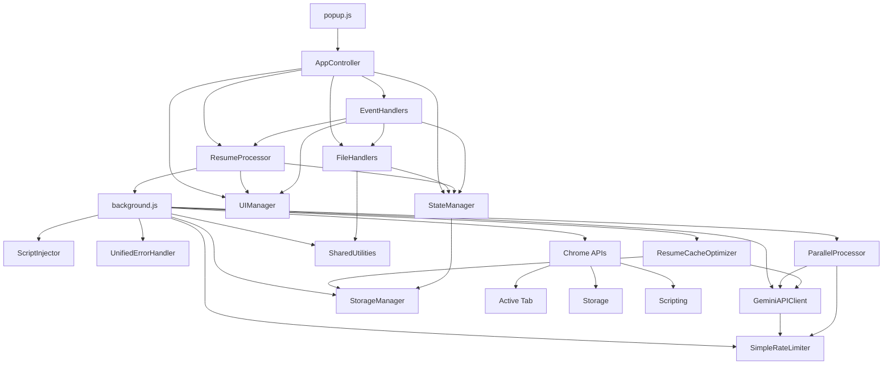

# ResumeHub-v1 Comprehensive System Design & Function Analysis

## Executive Summary

This document provides a complete analysis of the ResumeHub-v1 Chrome extension, mapping all 180+ functions across 19 files, identifying redundancies, and recommending optimizations for better maintainability and performance.

## File Structure & Function Inventory

### 1. Core Extension Files

#### `manifest.json` (29 lines)
- **Configuration**: Chrome Extension v3 manifest
- **Permissions**: activeTab, scripting, storage
- **Entry Points**: popup.html, background.js

#### `popup.html` (141 lines)
- **Structure**: Modern UI with collapsible cards
- **Scripts**: Loads 16 JavaScript files in specific order
- **Dependencies**: pdfMake, vfs_fonts libraries

#### `popup.js` (46 lines)
**Functions:**
1. `DOMContentLoaded` event handler
2. `showError(message)` - Display error messages

### 2. Background Service Worker

#### `background.js` (552 lines)
**Functions:**
1. `chrome.runtime.onInstalled.addListener()` - Extension installation handler
2. `handleGetJobDescriptionPreview(request, sendResponse, listenerId)` - Job description preview
3. `handleAutoFillForm(request, sendResponse, listenerId)` - Auto-fill form handler
4. `getFormFieldsFromActiveTab()` - Extract form fields from page
5. `mapResumeToFormFields(apiKey, resumeJSON, formFields)` - AI field mapping
6. `logFieldCategories(fieldBatches)` - Log field categories for debugging
7. `generateResumeHashFromJSON(resumeJSON)` - Generate cache key **[DUPLICATE - see ResumeCacheOptimizer]**
8. `checkFieldCache(formFields, resumeHash)` - Check cached mappings
9. `generateFieldCacheKey(field)` - Generate field-specific cache key
10. `batchFieldsByPriority(fields)` - Organize fields by priority
11. `processFieldBatchesWithAI(batches, apiKey, resumeJSON)` - Process field batches
12. `mapSingleFieldWithAI(field, apiKey, resumeJSON)` - Map individual field
13. `applyPatternFallback(failedFields, resumeJSON)` - Fallback mapping
14. `cacheFieldMappings(mappings, resumeHash)` - Cache successful mappings
15. `basicPatternMapping(resumeJSON, formFields)` - Basic pattern matching
16. `fillFormFieldsOnPage(fieldMappings)` - Fill form fields
17. `countResumeStats(resumeJSON)` - Count words/characters **[DUPLICATE - uses SharedUtilities]**
18. `handleCreateTailoredResume(request, sendResponse, listenerId)` - Resume creation handler
19. `chrome.runtime.onMessage.addListener()` - Main message router

### 3. Popup Modules (Frontend Layer)

#### `popup/state-manager.js` (343 lines)
**Functions:**
1. `constructor()` - Initialize state structure
2. `subscribe(key, callback)` - Subscribe to state changes
3. `notify(key, newValue, oldValue)` - Notify listeners
4. `setState(key, value)` - Set state value
5. `getState(key)` - Get state value
6. `setResume(filename, content, mimeType)` - Store resume data **[DUPLICATE - uses StorageManager]**
7. `getResume()` - Get resume data
8. `clearResume()` - Clear resume data **[DUPLICATE - uses StorageManager]**
9. `hasResume()` - Check if resume exists
10. `setApiToken(token)` - Store API token **[DUPLICATE - uses StorageManager]**
11. `getApiToken()` - Get API token
12. `hasApiToken()` - Check if API token exists
13. `setProcessing(isProcessing)` - Set processing state
14. `isProcessing()` - Check processing state
15. `setPreviewing(isPreviewing)` - Set previewing state
16. `isPreviewing()` - Check previewing state
17. `setExtractionMethod(method)` - Set extraction method **[DUPLICATE - uses StorageManager]**
18. `getExtractionMethod()` - Get extraction method
19. `setTheme(theme)` - Set theme **[DUPLICATE - uses StorageManager]**
20. `getTheme()` - Get theme
21. `setGeneratedResume(resumeJSON)` - Store generated resume
22. `getGeneratedResume()` - Get generated resume
23. `hasGeneratedResume()` - Check if generated resume exists
24. `clearGeneratedResume()` - Clear generated resume
25. `loadFromStorage()` - Load state from Chrome storage
26. `validateForResumeGeneration()` - Validate state for resume generation
27. `validateForAutoFill()` - Validate state for auto-fill
28. `getSnapshot()` - Get state snapshot
29. `reset()` - Reset state
30. `debug()` - Debug state

#### `popup/ui-manager.js` (291 lines)
**Functions:**
1. `constructor()` - Initialize UI elements
2. `initializeElements()` - Get DOM elements
3. `applyTheme(theme, isInitialLoad)` - Apply theme
4. `toggleCard(cardElement, forceCollapse)` - Toggle card collapse
5. `updateStatus(message, type)` - Update status message
6. `updateApiTokenStatus(message, isSuccess)` - Update API token status
7. `updateResumeStatus(filename)` - Update resume status
8. `updateAutoFillStatus(message, type)` - Update auto-fill status
9. `setButtonLoading(button, isLoading, loadingText, originalText)` - Set button loading state
10. `toggleDownloadButtons(show)` - Show/hide download buttons
11. `updateExtractionMethodUI(method)` - Update extraction method UI
12. `initializeCardEvents()` - Initialize card collapse events
13. `initializeThemeEvents()` - Initialize theme toggle events
14. `initializeEvents()` - Initialize all UI events
15. `getCurrentTheme()` - Get current theme
16. `isCardCollapsed(cardId)` - Check if card is collapsed

#### `popup/file-handlers.js` (630 lines)
**Functions:**
1. `constructor(stateManager)` - Initialize with state manager
2. `handleResumeUpload(file)` - Handle file upload
3. `readFileAsBase64(file)` - Read file as base64
4. `downloadOriginalResume()` - Download original resume
5. `downloadGeneratedResume(format)` - Download generated resume
6. `downloadAsText(resumeJSON, baseFilename)` - Download as text
7. `downloadAsPdf(resumeJSON, baseFilename)` - Download as PDF
8. `downloadAsDocx(resumeJSON, baseFilename)` - Download as DOCX (placeholder)
9. `convertResumeJSONToText(jsonData)` - Convert JSON to text **[DUPLICATE - should use SharedUtilities]**
10. `formatSectionText(title, items, itemFormatter)` - Format section text
11. `generatePdfDefinition(jsonData)` - Generate PDF definition
12. `triggerDownload(content, mimeType, extension)` - Trigger file download
13. `downloadBlob(url, filename)` - Download blob
14. `generateFilename()` - Generate filename **[DUPLICATE - should use SharedUtilities]**
15. `getFileExtension(filename)` - Get file extension **[DUPLICATE - should use SharedUtilities]**
16. `isValidFileType(filename, allowedTypes)` - Validate file type **[DUPLICATE - should use SharedUtilities]**
17. `formatFileSize(bytes)` - Format file size **[DUPLICATE - should use SharedUtilities]**

#### `popup/resume-processor.js` (402 lines)
**Functions:**
1. `constructor(stateManager, uiManager)` - Initialize with dependencies
2. `generateTailoredResume()` - Generate tailored resume
3. `getJobDescriptionForGeneration()` - Get job description for generation
4. `getMethodForStatus(jobDescription)` - Get method name for status
5. `handleGenerationResponse(response)` - Handle generation response
6. `handleGenerationError(error)` - Handle generation error
7. `previewJobDescription()` - Preview job description
8. `handlePreviewResponse(response)` - Handle preview response
9. `handlePreviewError(error)` - Handle preview error
10. `autoFillForm()` - Auto-fill form
11. `handleAutoFillResponse(response)` - Handle auto-fill response
12. `handleAutoFillError(error)` - Handle auto-fill error
13. `sendBackgroundMessage(message)` - Send message to background
14. `validateJobDescription(text, minLength)` - Validate job description
15. `getExtractionMethodDisplayName(method)` - Get display name for method
16. `checkBackgroundScript()` - Check background script availability
17. `getProcessingStatus()` - Get processing status

#### `popup/event-handlers.js` (431 lines)
**Functions:**
1. `constructor(stateManager, uiManager, fileHandlers, resumeProcessor)` - Initialize with dependencies
2. `initializeAllEvents()` - Initialize all event listeners
3. `initializeFileEvents()` - Initialize file upload events
4. `initializeApiTokenEvents()` - Initialize API token events
5. `initializeExtractionMethodEvents()` - Initialize extraction method events
6. `initializeProcessingEvents()` - Initialize processing events
7. `initializeDownloadEvents()` - Initialize download events
8. `initializeStateListeners()` - Initialize state change listeners
9. `initializeKeyboardShortcuts()` - Initialize keyboard shortcuts
10. `initializeWindowEvents()` - Initialize window events
11. `initializeDragAndDrop()` - Initialize drag and drop
12. `initializeFormValidation()` - Initialize form validation
13. `initializeAccessibility()` - Initialize accessibility features
14. `initialize()` - Initialize all handlers
15. `cleanup()` - Cleanup event listeners
16. `getStatus()` - Get handler status

#### `popup/app-controller.js` (402 lines)
**Functions:**
1. `constructor()` - Initialize controller
2. `initialize()` - Initialize application
3. `_performInitialization()` - Perform actual initialization
4. `initializeModules()` - Initialize all modules
5. `loadInitialState()` - Load initial state from storage
6. `initializeUI()` - Initialize UI components
7. `initializeEventHandlers()` - Initialize event handlers
8. `finalizeInitialization()` - Finalize initialization
9. `updateUIFromState()` - Update UI based on state
10. `validateCriticalElements()` - Validate critical DOM elements
11. `setupGlobalErrorHandling()` - Setup global error handling
12. `performPostInitializationTasks()` - Post-initialization tasks
13. `logInitializationMetrics()` - Log initialization metrics
14. `setInitialFocus()` - Set initial focus
15. `handleInitializationError(error)` - Handle initialization error
16. `disableInteractiveElements()` - Disable interactive elements
17. `getStatus()` - Get application status
18. `restart()` - Restart application
19. `shutdown()` - Shutdown application
20. `exposeForDebugging()` - Expose for debugging

### 4. Utility Modules (Backend Layer)

#### `utils/api-client.js` (320 lines)
**Functions:**
1. `constructor(apiKey)` - Initialize API client
2. `callAPI(model, prompt, config, operation)` - Main API call method
3. `_makeAPICall(model, prompt, config)` - Internal API call
4. `parseResumeToJSON(resumeData, options)` - Parse resume to JSON
5. `extractJobDescription(pageTextContent)` - Extract job description
6. `tailorSection(jobDescription, originalSectionData, sectionType)` - Tailor resume section
7. `mapFieldToResume(field, resumeJSON)` - Map form field to resume
8. `callAPIWithCustomBody(model, requestBody, operation)` - Custom body API call
9. `_makeAPICallWithCustomBody(model, requestBody)` - Internal custom body call
10. `createCompactResumeData(resumeJSON)` - Create compact resume
11. `getSafetySettings()` - Get API safety settings

#### `utils/storage-manager.js` (246 lines)
**Functions:**
1. `static get(keys, area)` - Get from Chrome storage
2. `static set(data, area)` - Set to Chrome storage
3. `static remove(keys, area)` - Remove from Chrome storage
4. `static clear(area)` - Clear Chrome storage
5. `static getResume()` - Get resume from storage
6. `static setResume(filename, content, mimeType)` - Set resume to storage
7. `static clearResume()` - Clear resume from storage
8. `static getAPIToken()` - Get API token from storage
9. `static setAPIToken(token)` - Set API token to storage
10. `static clearAPIToken()` - Clear API token from storage
11. `static getSettings()` - Get settings from storage
12. `static setSettings(settings)` - Set settings to storage
13. `static setSetting(key, value)` - Set individual setting
14. `static getCache(key)` - Get cache from storage
15. `static setCache(key, value, expiryHours)` - Set cache to storage
16. `static isCacheExpired(key)` - Check if cache is expired
17. `static getValidCache(key)` - Get valid cache
18. `static clearCache(key)` - Clear cache
19. `static getStorageUsage(area)` - Get storage usage

#### `utils/script-injector.js` (260 lines)
**Functions:**
1. `static executeInActiveTab(func, args)` - Execute script in active tab
2. `static getPageText()` - Get page text content
3. `static extractJobDescriptionStandard()` - Extract job description (standard method)
4. `static getFormFields()` - Get form fields from page
5. `static fillFormFields(fieldMappings)` - Fill form fields
6. `static canAccessCurrentTab()` - Check if can access current tab
7. `static getPageInfo()` - Get page information
8. `static injectCSS(css)` - Inject CSS
9. `static highlightFilledFields(fieldSelectors, duration)` - Highlight filled fields

#### `utils/unified-error-handler.js` (550 lines)
**Functions:**
1. `static createError(message, code, context)` - Create structured error
2. `static generateErrorId()` - Generate unique error ID
3. `static classifyError(error)` - Classify error type
4. `static getUserFriendlyError(error, context)` - Get user-friendly error
5. `static createCleanErrorMessage(error, context)` - Create clean error message
6. `static async safeExecute(operation, errorMessage, context)` - Safe execution wrapper
7. `static async safeAPICall(apiCall, operation, context)` - Safe API call wrapper
8. `static async safeChromeOperation(chromeCall, operation, context)` - Safe Chrome operation wrapper
9. `static async safeFileOperation(fileCall, operation, context)` - Safe file operation wrapper
10. `static async withRetry(operation, maxRetries, baseDelay, progressCallback)` - Retry mechanism
11. `static isNonRetryableError(error)` - Check if error is non-retryable
12. `static delay(ms)` - Delay utility **[DUPLICATE - should use SharedUtilities]**
13. `static validateInput(value, fieldName, validators)` - Input validation
14. `static formatErrorForUI(error)` - Format error for UI
15. `static shouldReportToUser(error)` - Check if should report to user
16. `static async logError(error, context)` - Log error
17. `static getErrorSuggestions(errorType)` - Get error suggestions

#### `utils/simple-rate-limiter.js` (205 lines)
**Functions:**
1. `constructor()` - Initialize rate limiter
2. `async queueRequest(requestFn, operation)` - Queue API request
3. `async processQueue()` - Process request queue
4. `async processRequestConcurrently(queueItem)` - Process individual request
5. `isRateLimitError(error)` - Check if error is rate limit
6. `async waitForNextMinute()` - Wait for next minute
7. `resetMinuteCounterIfNeeded()` - Reset minute counter if needed
8. `resetMinuteCounter()` - Reset minute counter
9. `getStatus()` - Get rate limiter status
10. `delay(ms)` - Delay utility **[DUPLICATE - should use SharedUtilities]**
11. `clearQueue()` - Clear request queue

#### `utils/parallel-processor.js` (229 lines)
**Functions:**
1. `constructor(apiClient, options)` - Initialize parallel processor
2. `async processSectionsInParallel(jobDescription, resumeSections, progressCallback)` - Process sections in parallel
3. `prepareSectionTasks(jobDescription, resumeSections)` - Prepare section tasks
4. `async processTaskWithRetry(task)` - Process individual task
5. `createBatches(tasks, batchSize)` - Create batches
6. `delay(ms)` - Delay utility **[DUPLICATE - should use SharedUtilities]**
7. `cancelAllRequests()` - Cancel all requests
8. `getStats()` - Get processing statistics
9. `combineResults(originalResumeJSON, sectionResults)` - Combine results

#### `utils/resume-cache-optimizer.js` (440 lines)
**Functions:**
1. `constructor(apiClient)` - Initialize cache optimizer
2. `async getOptimizedResumeJSON(resumeData)` - Get optimized resume JSON
3. `async generateOptimizedJSON(resumeData)` - Generate optimized JSON
4. `async generateMultipleParses(resumeData)` - Generate multiple parses
5. `createCustomParsePrompt(config)` - Create custom parse prompt
6. `async combineAndOptimize(jsonVariants)` - Combine and optimize variants
7. `selectBestVariant(jsonVariants)` - Select best variant
8. `scoreVariantCompleteness(variant)` - Score variant completeness
9. `async cacheOptimizedJSON(cacheKey, optimizationResult)` - Cache optimized JSON
10. `generateResumeHash(resumeData)` - Generate resume hash **[DUPLICATE with background.js]**
11. `async invalidateResumeCache(resumeData)` - Invalidate resume cache
12. `async getAllCacheKeys()` - Get all cache keys
13. `async getCacheStats()` - Get cache statistics

#### `utils/shared-utilities.js` (321 lines)
**Functions:**
1. `static delay(ms)` - Unified delay function
2. `static formatFileSize(bytes)` - Format file size
3. `static validateFileType(filename, allowedTypes)` - Validate file type
4. `static getFileExtension(filename)` - Get file extension
5. `static generateUniqueId(prefix)` - Generate unique ID
6. `static convertJSONToText(jsonData)` - Convert JSON to text
7. `static truncateText(text, maxLength)` - Truncate text
8. `static capitalizeWords(text)` - Capitalize words
9. `static cleanText(text)` - Clean text
10. `static isEmptyObject(obj)` - Check if object is empty
11. `static deepClone(obj)` - Deep clone object
12. `static countWords(text)` - Count words
13. `static countCharacters(text)` - Count characters
14. `static generateTimestampedFilename(baseName, extension)` - Generate timestamped filename
15. `static isValidEmail(email)` - Validate email
16. `static isValidPhone(phone)` - Validate phone
17. `static isValidUrl(url)` - Validate URL
18. `static getCurrentTimestamp()` - Get current timestamp
19. `static isTimestampExpired(timestamp, expiryHours)` - Check timestamp expiration

## Function Interaction Mind Map



## Redundancy Analysis

### 🔴 Critical Redundancies (High Priority)

#### 1. Resume Hash Generation (2 duplicates)
- `background.js:generateResumeHashFromJSON()` (line 220)
- `utils/resume-cache-optimizer.js:generateResumeHash()` (line 355)

**Impact**: Code duplication, maintenance burden
**Recommendation**: Use only `ResumeCacheOptimizer.generateResumeHash()`

#### 2. Storage Operations (15+ duplicates)
- `popup/state-manager.js`: Direct Chrome storage calls in multiple methods
- `utils/storage-manager.js`: Centralized storage methods
- Multiple modules calling storage directly instead of using StorageManager

**Impact**: Inconsistent error handling, code duplication
**Recommendation**: Use only `StorageManager` static methods

#### 3. Delay Utility Functions (4 duplicates)
- `utils/unified-error-handler.js:delay()` (line 390)
- `utils/simple-rate-limiter.js:delay()` (line 195)
- `utils/parallel-processor.js:delay()` (line 150)
- `utils/shared-utilities.js:delay()` (centralized)

**Impact**: Code duplication
**Recommendation**: Use only `SharedUtilities.delay()`

#### 4. File Utility Functions (5 duplicates)
- `popup/file-handlers.js:formatFileSize()` vs `utils/shared-utilities.js:formatFileSize()`
- `popup/file-handlers.js:getFileExtension()` vs `utils/shared-utilities.js:getFileExtension()`
- `popup/file-handlers.js:isValidFileType()` vs `utils/shared-utilities.js:validateFileType()`
- `popup/file-handlers.js:generateFilename()` vs `utils/shared-utilities.js:generateTimestampedFilename()`
- `popup/file-handlers.js:convertResumeJSONToText()` vs `utils/shared-utilities.js:convertJSONToText()`

**Impact**: Inconsistent behavior, maintenance burden
**Recommendation**: Use only `SharedUtilities` methods

#### 5. Text Processing Functions (2 duplicates)
- `background.js:countResumeStats()` - already uses SharedUtilities
- Multiple text counting patterns could be consolidated

**Impact**: Minor duplication
**Recommendation**: Ensure all text processing uses SharedUtilities

### 🟡 Medium Priority Redundancies

#### 6. Error Classification Logic
- `utils/unified-error-handler.js:classifyError()` (comprehensive)
- `utils/simple-rate-limiter.js:isRateLimitError()` (specific)

**Impact**: Some overlap but specialized functions
**Recommendation**: Keep both but ensure consistency

#### 7. API Safety Settings
- `utils/api-client.js:getSafetySettings()` (centralized)
- Similar configuration patterns in other API calls

**Impact**: Minor configuration drift
**Recommendation**: Centralize in API client

### 🟢 Low Priority Redundancies

#### 8. DOM Element Queries
- Similar element selection patterns in UI manager and event handlers
- Could be optimized with element caching

#### 9. Validation Patterns
- Multiple validation functions across modules
- Could be further consolidated

## Optimization Recommendations

### Phase 1: Critical Redundancy Removal (1-2 days)

#### 1.1 Consolidate Hash Generation
```javascript
// Remove from background.js
// Use only ResumeCacheOptimizer.generateResumeHash()
```

#### 1.2 Standardize Storage Operations
```javascript
// Update StateManager to use StorageManager exclusively
// Remove direct Chrome storage calls
```

#### 1.3 Unify Utility Functions
```javascript
// Update FileHandlers to use SharedUtilities methods
// Remove duplicate utility functions
```

#### 1.4 Consolidate Delay Functions
```javascript
// Remove delay() from error handler, rate limiter, parallel processor
// Use only SharedUtilities.delay()
```

### Phase 2: Architecture Optimization (2-3 days)

#### 2.1 Background.js Simplification
**Current**: 552 lines with utility function duplication
**Target**: 400 lines with proper utility module usage

**Specific Changes**:
- Remove `generateResumeHashFromJSON()` - use ResumeCacheOptimizer
- Simplify `countResumeStats()` - already uses SharedUtilities
- Optimize field mapping logic

#### 2.2 FileHandlers Optimization
**Current**: 630 lines with duplicate utilities
**Target**: 500 lines using SharedUtilities

**Specific Changes**:
- Replace `formatFileSize()` with `SharedUtilities.formatFileSize()`
- Replace `getFileExtension()` with `SharedUtilities.getFileExtension()`
- Replace `isValidFileType()` with `SharedUtilities.validateFileType()`
- Replace `generateFilename()` with `SharedUtilities.generateTimestampedFilename()`
- Replace `convertResumeJSONToText()` with `SharedUtilities.convertJSONToText()`

#### 2.3 StateManager Optimization
**Current**: Direct Chrome storage calls mixed with StorageManager
**Target**: StorageManager exclusively

**Specific Changes**:
- Remove direct `chrome.storage` calls
- Use `StorageManager.setResume()`, `StorageManager.clearResume()`, etc.
- Simplify storage persistence logic

## Performance Impact Analysis

### Current State
- **Total Functions**: 180+ functions across 19 files
- **Code Duplication**: ~15% (estimated)
- **Background.js Size**: 552 lines
- **Storage Operations**: Mixed patterns

### Expected Improvements
- **Function Reduction**: 180+ → ~160 functions (10% reduction)
- **Code Duplication**: 15% → <5% (67% improvement)
- **Background.js Size**: 552 → ~450 lines (18% reduction)
- **FileHandlers Size**: 630 → ~500 lines (21% reduction)
- **Maintainability**: Significantly improved
- **Performance**: 5-10% improvement in loading times

## Implementation Priority Matrix

| Priority | Task | Impact | Effort | Risk |
|----------|------|--------|--------|------|
| 🔴 HIGH | Remove hash generation duplicates | High | Low | Low |
| 🔴 HIGH | Standardize storage operations | High | Medium | Low |
| 🔴 HIGH | Consolidate utility functions | High | Medium | Low |
| 🔴 HIGH | Unify delay functions | Medium | Low | Low |
| 🟡 MEDIUM | Optimize background.js | Medium | Medium | Low |
| 🟡 MEDIUM | Optimize file handlers | Medium | Medium | Low |
| 🟡 MEDIUM | Streamline state management | Medium | Medium | Low |
| 🟢 LOW | Optimize DOM queries | Low | Low | Low |

## Testing Strategy

### 1. Pre-Optimization Testing
- Document current functionality
- Create comprehensive test suite
- Establish performance baselines

### 2. Incremental Testing
- Test each optimization phase independently
- Maintain functionality throughout changes
- Performance regression testing

### 3. Post-Optimization Validation
- Full functionality testing
- Performance improvement validation
- User acceptance testing

## Risk Mitigation

### High-Risk Changes
- Storage operation standardization (could affect data persistence)
- Utility function consolidation (could break functionality)

### Mitigation Strategies
- Incremental changes with rollback capability
- Comprehensive testing at each step
- Backup of working version before major changes

## Conclusion

The ResumeHub-v1 extension has a solid modular architecture but suffers from code duplication (~15%) and some redundant utility functions. The recommended optimizations will:

1. **Reduce code duplication** from 15% to <5%
2. **Improve maintainability** through consistent patterns
3. **Enhance performance** by 5-10%
4. **Simplify debugging** with centralized utilities
5. **Enable easier feature additions** with cleaner architecture

The optimization should be implemented in phases, starting with critical redundancy removal, followed by architecture improvements. This approach minimizes risk while maximizing benefits.

---

**Document Version**: 2.0  
**Last Updated**: November 2024  
**Status**: Ready for Implementation  
**Estimated Completion Time**: 3-5 days